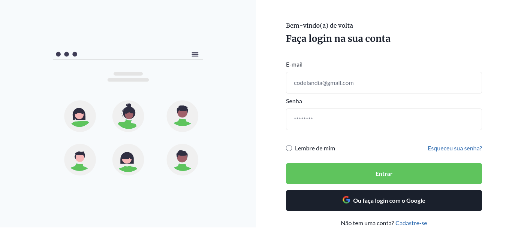

# Página de login - Desafio 04 da Comunidade Codelândia

## 💻 Projeto
Esta página de login é o projeto do Desafio 04 da Comunidade Codelândia, criada por [Iuri Code](https://www.linkedin.com/in/iuricode/)

&nbsp;

## 🔍 Layout

[Clique aqui para ter acesso ao Figma](https://www.figma.com/file/Yb9IBH56g7T1hdIyZ3BMNO/Desafios---Codel%C3%A2ndia?node-id=4588%3A99&t=HWRvZjZFiAahsx6j-0)

&nbsp;

## 🛠 Tecnologias utilizadas

* HTML
* TailwindCSS

📱 Desenvolvido em _mobile first_

&nbsp;

## 🚀 Deploy
[Clique aqui](https://lyaricci.github.io/codelandia-desafio-04/) para ver o resultado!
